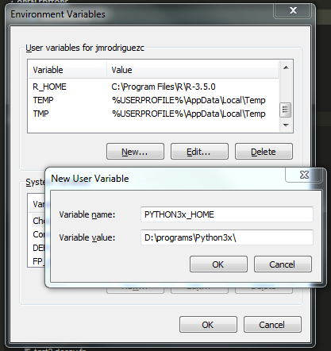

# DecoyPYrat.v2 - Fast Hybrid Decoy Sequence Database Creation for Proteomic Mass Spectromtery Analyses

Improvement on DecoyPYrat script from Sanger (https://www.sanger.ac.uk/science/tools/decoypyrat)

## Installation

1. Download and execute the latest Python 3.* installation package from [here](https://www.python.org/downloads/windows/).  
_While either 32-bit (x86) or 64-bit (x86-64) versions should work just fine_
* Verify a successful installation by opening a command prompt window and navigating to your Python installation directory (Note!! Keep in mind the Path).  Type `python` from this location to launch the Python interpreter.

    ```
    Microsoft Windows [Version 6.1.7601]
    Copyright (c) 2009 Microsoft Corporation.  All rights reserved.

    C:\Users\jmrodriguezc>python
    Python 3.7.0 (v3.7.0:1bf9cc5093, Jun 27 2018, 04:59:51) [MSC v.1914 64 bit (AMD64)] on win32
    Type "help", "copyright", "credits" or "license" for more information.
    >>>
    ```

2. Add the environment variable "PYTHON3x_HOME" with the installed python.
*_In Windows 7 and Windows 8, simply searching for "environment variables" will present the option to `Edit the system environment variables`. This will open the `System Properties / Advanced` tab_  
*_In Windows XP, right click on `My Computer->Properties` to open `System Properties` and click on the `Advanced` tab._  
 1. On the `System Properties / Advanced` tab, click `Environment Variables` to open `User Variables` and `System Variables`
 2. Create a new `User Variable` named Variable name: `PYTHON3x_HOME` and  Variable value: `whatever your installation path was`



3. Execute the batch script "install_win64.bat"


## Execution
1. Execute the decoyPYrat.v2.bat script.
2. Add the Target FASTA file (with *.fasta or *.fa extension)
2. Add the Decoy FASTA file (with *.fasta or *.fa extension)


